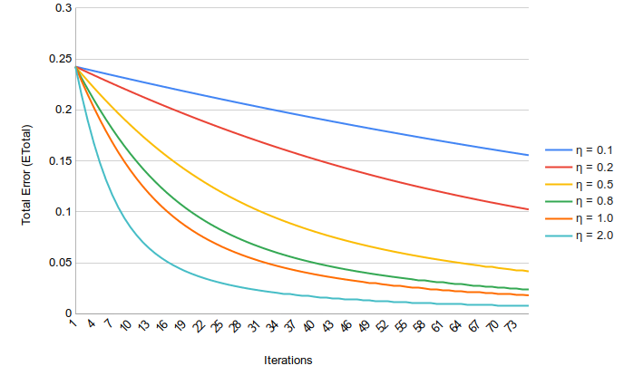
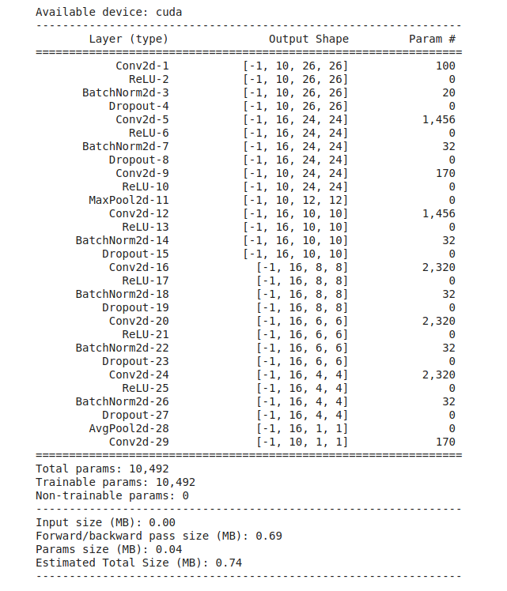

# Part1: Simple Neural Network in Excel Sheet

## Neural Network Diagram


## FeedForward : Calculate Errors
Feedforward equations based on the diagram above.


## Back propagation Equations : Get Gradients


1. We start with w5 and calculate the error delta for w5 and similarly solve error gradients for w6, w7 and w8.

2. Using the chain rule and above calculated gradients we calculate gradients for W1, w2, w3 and w4 too. Here we break the equation into two parts:

   a. output  ----> hidden layer

   b. hidden layer  ---> input layer.

---

## Training the Network


1. Initialize weights as the values given in diagram above.
2. Calculate the hidden node values and output values.
3. Calculate the Total Error by comparing outputs with Targets.
4. Get total error.
5. Use backward pass equation to get gradients for each weight against the error.
6. Reduce the weight values by the corresponding gradient values.
7. Move to next iteration with the weights from step6.
8. Repeat until you are tired.

## Results




# Part 2 : 99.5% Test accuracy on MNIST with less than 10500 parameters.

### Few of the Architectural Considerations :

1. Number of Parameters: **10492**
2. 3x3 Conv Layers = 6
3. Activation function: ReLU()
4. Batch Normalization: in each conv block
5. Dropout : 0.1 after each conv block
6. 1x1 for transition layer ( to assist Excite and Squeeze ) and for last layer
7. Maxpool in Transition Block
8. Global Average Pooling followed by 1x1 instead of FC layer
10. Learning Rate: Used Reduce LR On Plateau for maximum achievement.
    - base lr: 0.003
    - factor = 0.5
    - patience = 2

### Results:

Total Epochs : 20

1. Parameters: **10492**
2. Best Train Accuracy: 99.45
3. Test accuracy reached 99.41 at 11th Epoch
4. Best Test Accuracy: 99.5 (19th Epoch)


### Network Code

```python
dropout_value = 0.1
class Net(nn.Module):
    def __init__(self):
        super(Net, self).__init__()
        self.convblock1 = nn.Sequential(
            nn.Conv2d(in_channels=1, out_channels=10, kernel_size=(3, 3), bias=True),
            nn.ReLU(),
            nn.BatchNorm2d(10),
            nn.Dropout(dropout_value)                        
        )
        self.convblock2 = nn.Sequential(
            nn.Conv2d(in_channels=10, out_channels=16, kernel_size=(3, 3), bias=True),
            nn.ReLU(),
            nn.BatchNorm2d(16),
            nn.Dropout(dropout_value)                       
        )
        self.transitionblock1 = nn.Sequential(
            nn.Conv2d(in_channels=16, out_channels=10, kernel_size=(1, 1), bias=True),
            nn.ReLU()                     
        )

        # Maxpooling
        self.pool1 = nn.MaxPool2d(2, 2) 


        self.convblock3 = nn.Sequential(
            nn.Conv2d(in_channels=10, out_channels=16, kernel_size=(3, 3), bias=True),
            nn.ReLU(),
            nn.BatchNorm2d(16),
            nn.Dropout(dropout_value)                        
        )
        self.convblock4 = nn.Sequential(
            nn.Conv2d(in_channels=16, out_channels=16, kernel_size=(3, 3), bias=True),
            nn.ReLU(),
            nn.BatchNorm2d(16),
            nn.Dropout(dropout_value)                        
        )

        self.convblock5 = nn.Sequential(
            nn.Conv2d(in_channels=16, out_channels=16, kernel_size=(3, 3), bias=True),
            nn.ReLU(),
            nn.BatchNorm2d(16),
            nn.Dropout(dropout_value)                        
        )

        self.convblock6 = nn.Sequential(
            nn.Conv2d(in_channels=16, out_channels=16, kernel_size=(3, 3), bias=True),
            nn.ReLU(),
            nn.BatchNorm2d(16),
            nn.Dropout(dropout_value)                        
        )

        self.gap = nn.Sequential(
            nn.AvgPool2d(kernel_size=4)
        )

        self.translinear = nn.Sequential(
            nn.Conv2d(in_channels=16, out_channels=10, kernel_size=1, bias=True),
            )

    def forward(self, x):
        x = self.convblock1(x)
        x = self.convblock2(x)
        x = self.transitionblock1(x)
        x = self.pool1(x)
        x = self.convblock3(x)
        x = self.convblock4(x)
        x = self.convblock5(x)
        x = self.convblock6(x)
        x = self.gap(x)
        x = self.translinear(x)
        x = x.view(-1, 10)
        return x
```

 ### Network Parameter Summary



### Final Results


~~~

