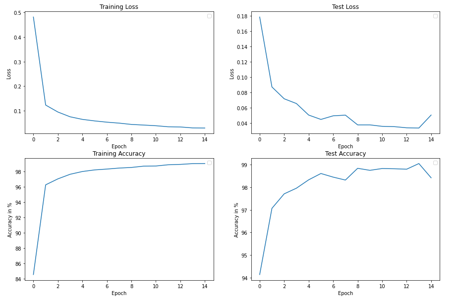
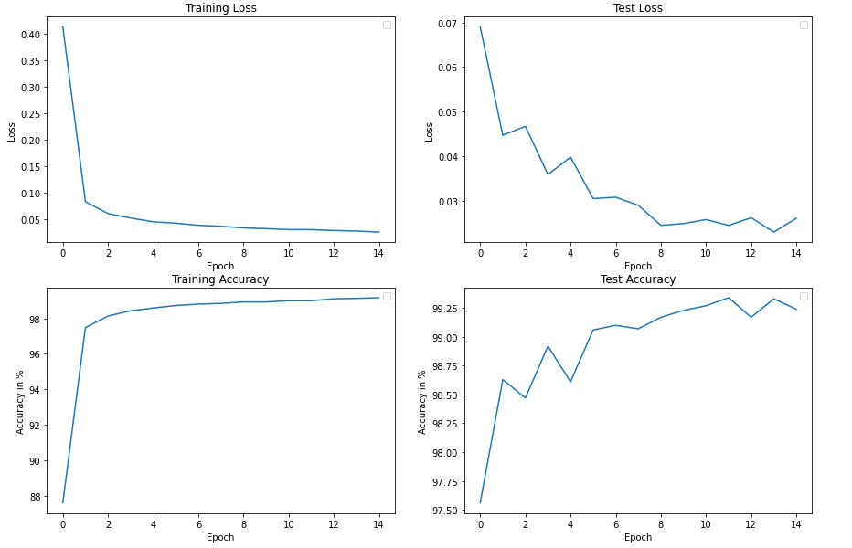
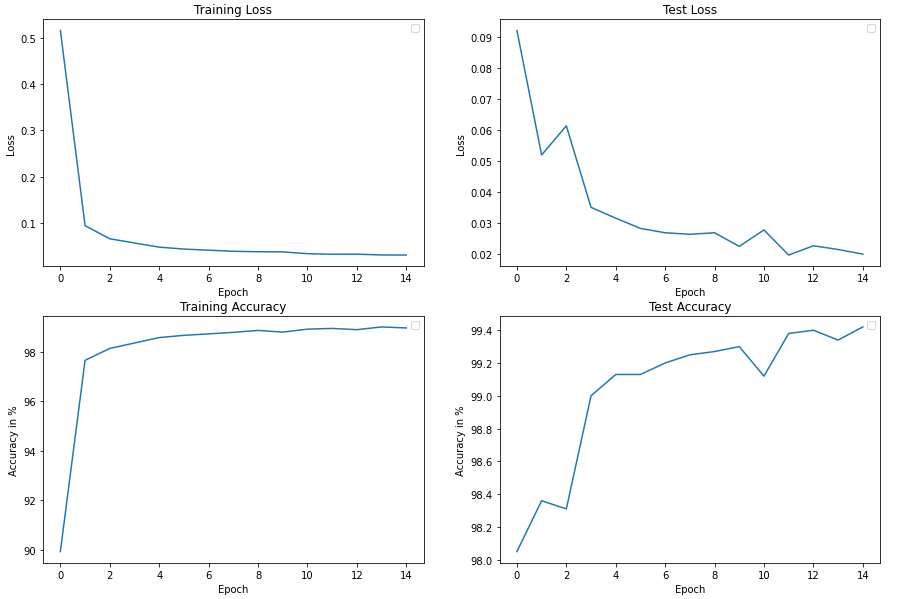
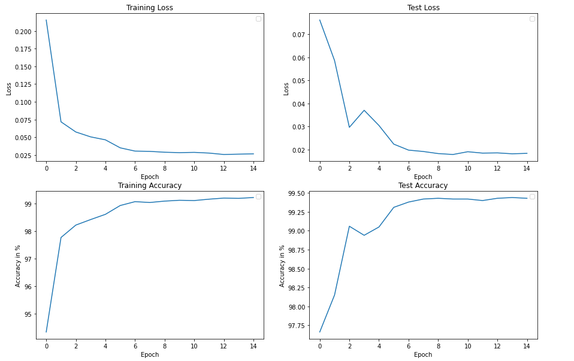

# Final Result: 99.4% accuracy in 8th epoch with less than 8k parameter.

## Step 1 : 99.05% Test accuracy on MNIST with 11,604 parameters in 15 epochs

### Target:

1. Create Basic set up for a Vanilla Network.
2. Set Data loader and set set basic training and testing loop 

### Few of the Architectural Considerations :

1. Number of Parameters: **11,604**
2. 3x3 Conv Layers = 7
3. Activation function: ReLU()
6. 1x1 for transition layer ( to assist Excite and Squeeze ) and for last layer
5. Maxpool in Transition Block
6. Learning Rate: Used Learning Rate of 0.001

### Results:

Total Epochs : 15

1. Parameters: **11604**

2. Best Train Accuracy: 99.05

3. Best Test Accuracy: 99.05 (14th Epoch)

   

### Analysis:

1. From  the result we can observe that test accuracy is oscillating and not at all steadily increasing which is expected as we have not used any relu and batch normalised technique.
2. Also, we can see model is over fitting a lot. We will try to reduce it in our next step.

## Step 2 : 99.34% Test accuracy on MNIST with 12,102 parameters in 15 epochs

### Target:

1. Implement Dropout and Batch normalisation to our existing network.

### Few of the Architectural Considerations :

1. Number of Parameters: **12,102**
2. 3x3 Conv Layers = 7
3. Activation function: ReLU()
4. Batch Normalization: in each conv block
5. Dropout : 0.1 after each conv block
6. 1x1 for transition layer ( to assist Excite and Squeeze ) and for last layer
7. Maxpool in Transition Block
8. Learning Rate: Used Learning Rate of 0.001

### Results:

Total Epochs : 15

1. Parameters: **12,102**

2. Best Train Accuracy: 99.16

3. Best Test Accuracy: 99.34 (11th Epoch)

   

### Analysis:

1. Just by implementing dropout and batch normalisation we can see that best accuracy jumped to 99.34% as expected.
2. Its a good model but with this model its very hard to reach 99.4% accuracy as we need to address over fitting issue as well as good learning rate to converge faster. We will try to improve further next step by addressing some of the issues.

## Step 3 : 99.42% Test accuracy on MNIST with 9,544 parameters in 15 epochs

### Target:

1. Reduce no of parameter less than 10k.
2. Implement random rotation of -5 to +5 degree as image augmentation
3. Implement a good LR scheduler.
4. Implement GAP.

### Few of the Architectural Considerations :

1. Number of Parameters: **9,544 **
2. 3x3 Conv Layers = 6
3. Activation function: ReLU()
4. Batch Normalization: in each conv block
5. Dropout : 0.1 after each conv block
6. 1x1 for transition layer ( to assist Excite and Squeeze ) and for last layer
7. Maxpool in Transition Block
8. Global Average Pooling followed by 1x1 instead of FC layer
9. Learning Rate: Used Reduce LR On Plateau for maximum achievement.
   - base lr: 0.001
   - patience = 5

### Results:

Total Epochs : 15

1. Parameters: **9,544 **

2. Best Train Accuracy: 99.01

3. Best Test Accuracy: 99.42 (15th Epoch)

4. Test accuracy reached 99.4 at 13th Epoch

   

### Analysis:

1. Here after implementing proper LR scheduler i.e. ReduceLROnPlateau we are able to reach 99.4% even with lesser no of parameter from our previous network.
2. This model is good but not a great one as though we have reach 99.4% but still it is not consistant and can be pushed further with tuning of LR scheduler parameter. Also, no of total parameter can also be reduced. We will try to address these in next steps to improve our model further.

## Step 3 : 99.43% Test accuracy on MNIST with 7,987 parameters in 8th epoch

### Target:

1. Reduce no of parameter less than 8k.
2. tune LR scheduler (ReduceLROnPlateau) parameter.

### Few of the Architectural Considerations :

1. Number of Parameters: **7,987 **
2. 3x3 Conv Layers = 6
3. Activation function: ReLU()
4. Batch Normalization: in each conv block
5. Dropout : 0.1 after each conv block
6. 1x1 for transition layer ( to assist Excite and Squeeze ) and for last layer
7. Maxpool in Transition Block
8. Global Average Pooling followed by 1x1 instead of FC layer
9. Learning Rate: Used Reduce LR On Plateau for maximum achievement.
   - base lr: 0.007
   - patience = 1

### Results:

Total Epochs : 15

1. Parameters: **7,987 **

2. Best Train Accuracy: 99.22

3. Best Test Accuracy: 99.43 (15th Epoch)

4. Test accuracy reached 99.42 at 7th Epoch

   

### Analysis:

1. This is a very good model which can achieve 99.4% accuracy in just 7th epoch with just less than 8k parameter. Also, accuracy is stable in 99.4% from 7th epoch.
2. We increased learning rate to 0.007 and patience value to 1 because ReduceLROnPlateau will decrease learning by a factor of 0.5 if accuracy reduces once from previous step. This way we are able to reach faster convergence.
3. Since we reduced the no of parameter a lot it is hard to achieve grater than 99.5% thats why accuracy is oscillating in the range 99.4% - 99.43%.
