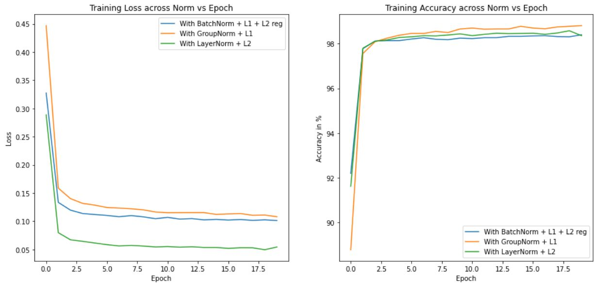
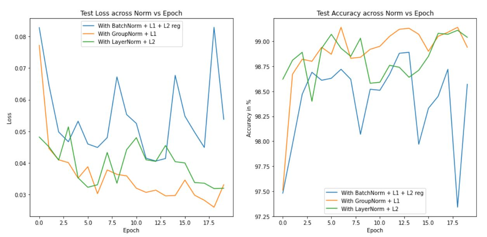
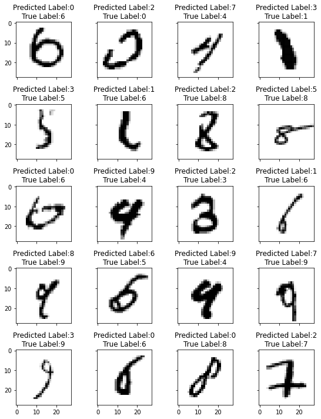
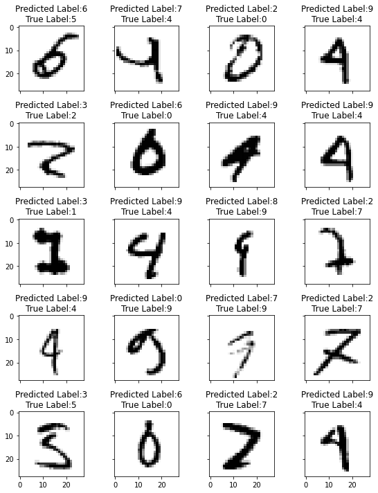
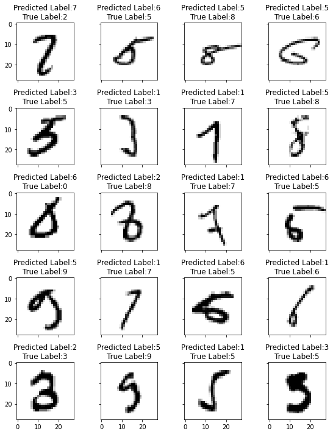

# Normalization and Regularization

The objective of this assignment is to design CNN model for image classification with weight regularization (L1 and L2) and normalization techniques (Batch Norm, Group Norm and Layer Norm) and observe their behaviour.

## Model Hyperparameters

Across models
* Optimizer: SGD
* Loss Function: Cross Entropy Loss
* Learning Rate: 0.04
* Dropout: 0.05
* Batch Size: 128
* Epochs: 20

#### Model 1: Batch Normalization + L1 + L2 regularization

* L1 regularization parameter: 0.0001
* L2 regularization parameter: 0.001 

#### Model 2: Group Normalization + L1 regularization

* L1 regularization parameter: 0.0001
* Group Norm- groups: 0.5 * channels

#### Model 3: Layer Normalization + L2 regularization

* L2 regularization parameter: 0.001
* Layer Norm- groups: 1

## Results

### Training loss/accuracy trend across normalization vs epochs

### Test loss/accuracy trend across normalization vs epochs

### Missclassified Images

#### Model 1: Batch Normalization + L1 + L2 regularization

#### Model 2: Group Normalization + L1 regularization

#### Model 3: Batch Normalization + L2 regularization

