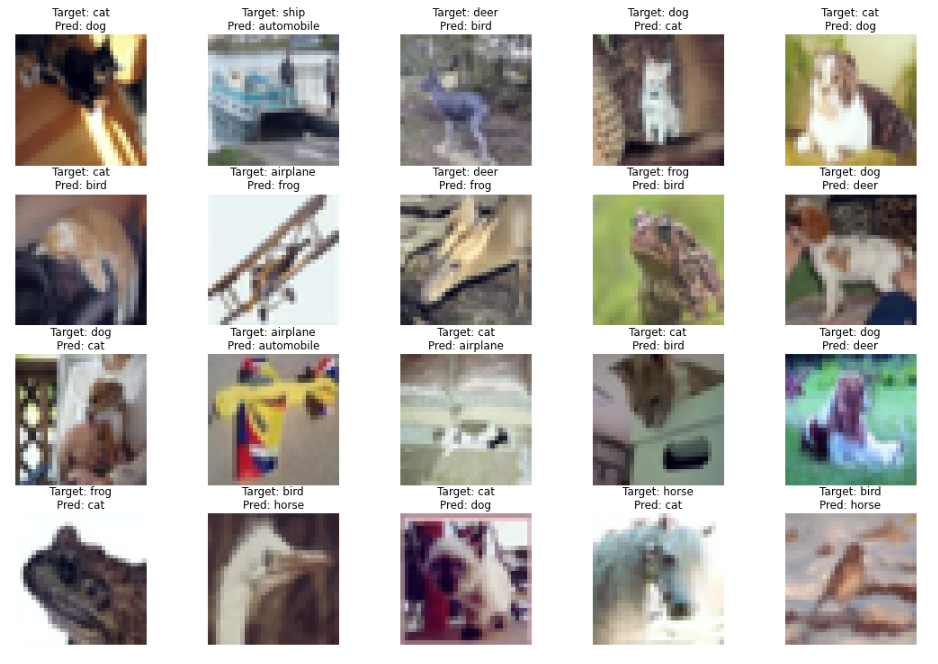

# CIFAR10-S8

## Target:

- Train deep learning repo training for 40 epoch

- Display 20 miss classified Images

- Display 20 GradCam output on the SAME misclassified images

- Apply these transforms while training:
  - RandomCrop(32, padding=4)
  - CutOut(16x16)
  - Rotate(±5°)

- Must use ReduceLROnPlateau

- Must use LayerNormalization ONLY

## Data

CIFAR10 dataset

Below are a sample of training dataset.


## Model Summary

```
----------------------------------------------------------------
        Layer (type)               Output Shape         Param #
================================================================
            Conv2d-1           [-1, 64, 32, 32]           1,728
         GroupNorm-2           [-1, 64, 32, 32]             128
            Conv2d-3           [-1, 64, 32, 32]          36,864
         GroupNorm-4           [-1, 64, 32, 32]             128
            Conv2d-5           [-1, 64, 32, 32]          36,864
         GroupNorm-6           [-1, 64, 32, 32]             128
        BasicBlock-7           [-1, 64, 32, 32]               0
            Conv2d-8           [-1, 64, 32, 32]          36,864
         GroupNorm-9           [-1, 64, 32, 32]             128
           Conv2d-10           [-1, 64, 32, 32]          36,864
        GroupNorm-11           [-1, 64, 32, 32]             128
       BasicBlock-12           [-1, 64, 32, 32]               0
           Conv2d-13          [-1, 128, 16, 16]          73,728
        GroupNorm-14          [-1, 128, 16, 16]             256
           Conv2d-15          [-1, 128, 16, 16]         147,456
        GroupNorm-16          [-1, 128, 16, 16]             256
           Conv2d-17          [-1, 128, 16, 16]           8,192
        GroupNorm-18          [-1, 128, 16, 16]             256
       BasicBlock-19          [-1, 128, 16, 16]               0
           Conv2d-20          [-1, 128, 16, 16]         147,456
        GroupNorm-21          [-1, 128, 16, 16]             256
           Conv2d-22          [-1, 128, 16, 16]         147,456
        GroupNorm-23          [-1, 128, 16, 16]             256
       BasicBlock-24          [-1, 128, 16, 16]               0
           Conv2d-25            [-1, 256, 8, 8]         294,912
        GroupNorm-26            [-1, 256, 8, 8]             512
           Conv2d-27            [-1, 256, 8, 8]         589,824
        GroupNorm-28            [-1, 256, 8, 8]             512
           Conv2d-29            [-1, 256, 8, 8]          32,768
        GroupNorm-30            [-1, 256, 8, 8]             512
       BasicBlock-31            [-1, 256, 8, 8]               0
           Conv2d-32            [-1, 256, 8, 8]         589,824
        GroupNorm-33            [-1, 256, 8, 8]             512
           Conv2d-34            [-1, 256, 8, 8]         589,824
        GroupNorm-35            [-1, 256, 8, 8]             512
       BasicBlock-36            [-1, 256, 8, 8]               0
           Conv2d-37            [-1, 512, 4, 4]       1,179,648
        GroupNorm-38            [-1, 512, 4, 4]           1,024
           Conv2d-39            [-1, 512, 4, 4]       2,359,296
        GroupNorm-40            [-1, 512, 4, 4]           1,024
           Conv2d-41            [-1, 512, 4, 4]         131,072
        GroupNorm-42            [-1, 512, 4, 4]           1,024
       BasicBlock-43            [-1, 512, 4, 4]               0
           Conv2d-44            [-1, 512, 4, 4]       2,359,296
        GroupNorm-45            [-1, 512, 4, 4]           1,024
           Conv2d-46            [-1, 512, 4, 4]       2,359,296
        GroupNorm-47            [-1, 512, 4, 4]           1,024
       BasicBlock-48            [-1, 512, 4, 4]               0
           Linear-49                   [-1, 10]           5,130
================================================================
Total params: 11,173,962
Trainable params: 11,173,962
Non-trainable params: 0
----------------------------------------------------------------
Input size (MB): 0.01
Forward/backward pass size (MB): 11.25
Params size (MB): 42.63
Estimated Total Size (MB): 53.89
```

## Results

1. Validation accuracy
    -  `87.10% in 75 epochs`
2.  Loss, Accuracy Plots

## Training Logs

```
Training Epoch: 31
Training Set: Loss=0.46270188586333827, Batch_id=390, Train Accuracy=83.95: 100%|██████████| 391/391 [01:03<00:00,  6.12it/s]
Test Set: Loss=0.4241160399551633, Batch_id=78, Test Accuracy=85.62: 100%|██████████| 79/79 [00:03<00:00, 26.27it/s]
  0%|          | 0/391 [00:00<?, ?it/s]Training Epoch: 32
Training Set: Loss=0.4419165281840907, Batch_id=390, Train Accuracy=84.58: 100%|██████████| 391/391 [01:03<00:00,  6.12it/s]
Test Set: Loss=0.4422580218767818, Batch_id=78, Test Accuracy=85.36: 100%|██████████| 79/79 [00:03<00:00, 24.10it/s]
  0%|          | 0/391 [00:00<?, ?it/s]Training Epoch: 33
Training Set: Loss=0.4430795018477818, Batch_id=390, Train Accuracy=84.62: 100%|██████████| 391/391 [01:04<00:00,  6.10it/s]
Test Set: Loss=0.4120236535238314, Batch_id=78, Test Accuracy=86.21: 100%|██████████| 79/79 [00:03<00:00, 26.26it/s]
  0%|          | 0/391 [00:00<?, ?it/s]
*****Saving Model*****
Training Epoch: 34
Training Set: Loss=0.4177911119997654, Batch_id=390, Train Accuracy=85.44: 100%|██████████| 391/391 [01:03<00:00,  6.12it/s]
Test Set: Loss=0.3836691742645034, Batch_id=78, Test Accuracy=86.89: 100%|██████████| 79/79 [00:02<00:00, 26.80it/s]
  0%|          | 0/391 [00:00<?, ?it/s]
*****Saving Model*****
Training Epoch: 35
Training Set: Loss=0.4145964382554564, Batch_id=390, Train Accuracy=85.55: 100%|██████████| 391/391 [01:03<00:00,  6.13it/s]
Test Set: Loss=0.36902735976478723, Batch_id=78, Test Accuracy=87.61: 100%|██████████| 79/79 [00:02<00:00, 26.36it/s]
  0%|          | 0/391 [00:00<?, ?it/s]
*****Saving Model*****
Training Epoch: 36
Training Set: Loss=0.4083064493849454, Batch_id=390, Train Accuracy=85.71: 100%|██████████| 391/391 [01:03<00:00,  6.12it/s]
Test Set: Loss=0.34759943432445767, Batch_id=78, Test Accuracy=88.55: 100%|██████████| 79/79 [00:03<00:00, 26.33it/s]
  0%|          | 0/391 [00:00<?, ?it/s]
*****Saving Model*****
Training Epoch: 37
Training Set: Loss=0.3968635926313717, Batch_id=390, Train Accuracy=86.15: 100%|██████████| 391/391 [01:03<00:00,  6.13it/s]
Test Set: Loss=0.374771595189843, Batch_id=78, Test Accuracy=87.70: 100%|██████████| 79/79 [00:03<00:00, 26.12it/s]
  0%|          | 0/391 [00:00<?, ?it/s]Training Epoch: 38
Training Set: Loss=0.384414941567899, Batch_id=390, Train Accuracy=86.65: 100%|██████████| 391/391 [01:03<00:00,  6.13it/s]
Test Set: Loss=0.36737139202371427, Batch_id=78, Test Accuracy=87.54: 100%|██████████| 79/79 [00:02<00:00, 26.76it/s]
  0%|          | 0/391 [00:00<?, ?it/s]Training Epoch: 39
Training Set: Loss=0.3805150451410152, Batch_id=390, Train Accuracy=86.65: 100%|██████████| 391/391 [01:03<00:00,  6.12it/s]
Test Set: Loss=0.422815702195409, Batch_id=78, Test Accuracy=86.08: 100%|██████████| 79/79 [00:03<00:00, 26.32it/s]
  0%|          | 0/391 [00:00<?, ?it/s]Training Epoch: 40
Training Set: Loss=0.3747829529635437, Batch_id=390, Train Accuracy=86.92: 100%|██████████| 391/391 [01:03<00:00,  6.12it/s]
Test Set: Loss=0.38401458346391026, Batch_id=78, Test Accuracy=87.34: 100%|██████████| 79/79 [00:03<00:00, 26.04it/s]

```

## Misclassified Images



## Misclassified GradCam Images


## Correctly Classified Images


## Correctly Classified GradCam Images


## Observation

- From results we can see using layer norm model converges slowly than using batch norm.
- From missclassified gradcam images we can conclude more different data augmentation strategy needed to increase test accuracy